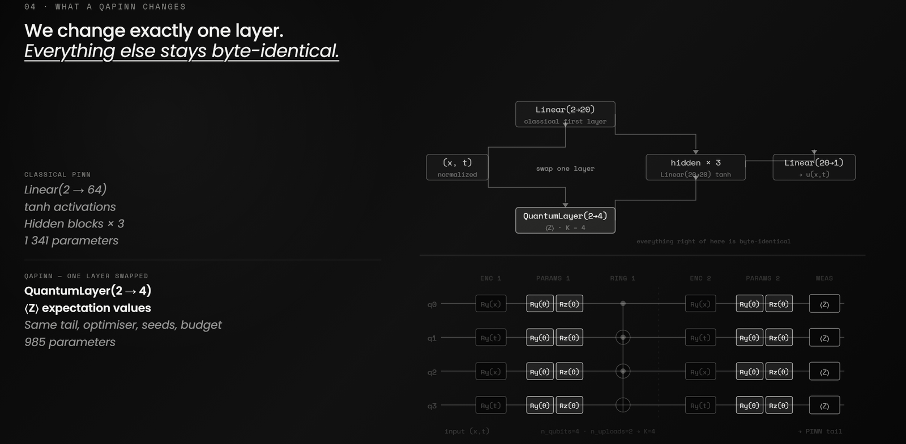
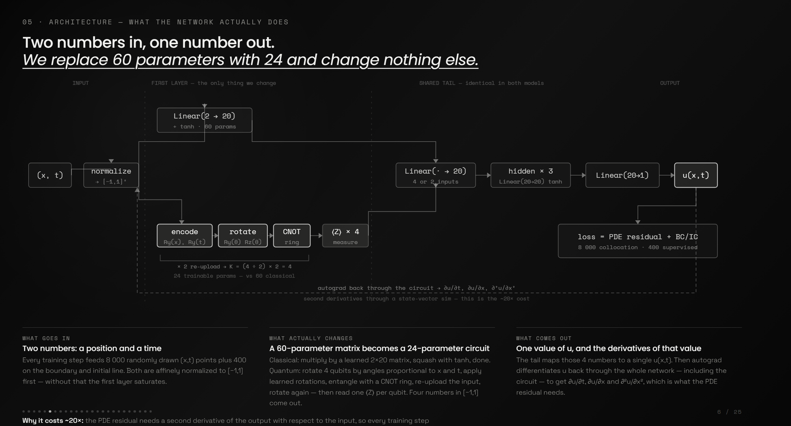
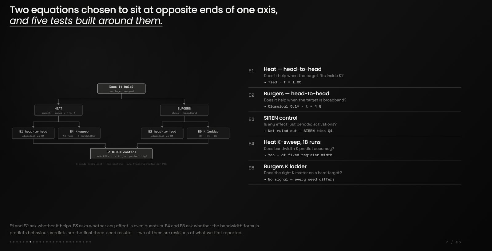
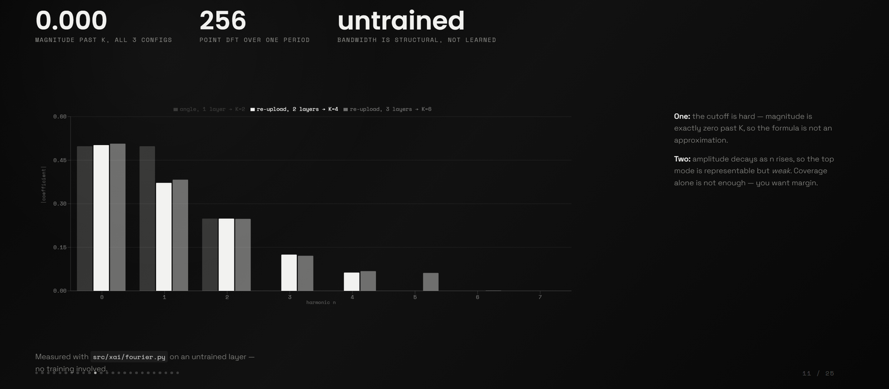
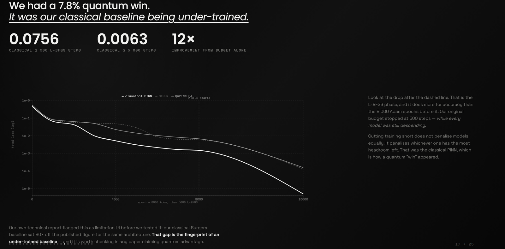

# QAPINN: Explainability of the Quantum Layer in Physics-Informed Neural Networks

WISER × BQP Global Quantum+AI 2026 Challenge. **Team SpectralQ.**

**[Presentation slides →](https://wiserbqp.netlify.app/)**  (interactive; arrow keys or
space to advance, `F` for fullscreen)

### Team

| Member | Email | Institution | Country |
|---|---|---|---|
| Shravan Kumar Sharma | ssharma5@nd.edu | University of Notre Dame | United States |
| Mayank Sharma | ep23bt009@iitdh.ac.in | Indian Institute of Technology Dharwad | India |
| Satyabrat Sahu | satyabratsahu71@gmail.com | Guru Gobind Singh Indraprastha University, Delhi | India |

### Contributions

- **Shravan Kumar Sharma** — Research direction and project coordination. Theoretical
  analysis connecting the Fourier-bandwidth result to PDE spectral content, interpretation
  of results, and writing and review of the technical report.
- **Mayank Sharma** — Implementation of the classical PINN, SIREN, and QAPINN models
  (`src/`) and the Fourier-spectrum diagnostic in `src/xai/`. Ran the initial benchmark
  suite and the Heat K-sweep. Audited the experiment configurations, identified that the
  original classical-vs-quantum comparisons used unequal training budgets (§8.4), and
  designed the matched-budget rerun in `configs/rerun/` that produced the final §8 results.
  Statistical analysis of the rerun and the presentation deck.
- **Satyabrat Sahu** — Experiment execution on cluster hardware and cross-machine
  reproducibility testing (§12.4). Analysis of run outputs, literature review, and
  documentation and presentation support.


This README is written so that someone who has never seen this repository (a teammate,
a grader, an interviewer) can read it top to bottom and understand what the project does,
why it is built this way, how to run every piece of it, and where it currently stands.
If you are short on time, read **Key findings** just below. If you can spare two full
sections, read **§1** and **§8**: section 1 explains the idea the rest of the repo is
built to test, and section 8 tells you whether that idea held up.

---

## Key findings

The full evidence and reasoning are in §8. This is the short version, for anyone who
does not have time to read the whole thing.

- **Heat (smooth, two-mode target): a statistical tie.** QAPINN's relative L2 error
  (0.000487) sits close to the classical PINN's (0.000243). A two-sample t-test
  (t = 1.05) cannot tell the two apart from seed noise across three seeds, so we call
  it a tie rather than a loss.
- **Burgers (sharp shock, broadband target): the classical network wins clearly.** The
  classical PINN beats QAPINN by roughly 3.1x (0.0063 vs. 0.0194 relative L2 error),
  and the gap is statistically significant (t between 4.8 and 4.82), not a lucky seed.
- **The bandwidth prediction held for the controlled Heat experiment.** Isolated to a
  fixed 4-qubit register, Heat's error forms a clean elbow at K = 4, matching the
  target's highest wavenumber and the circuit's Fourier structure before any training
  happens.
- **We caught our own mistake and reversed it.** An early pass showed QAPINN beating
  the classical network on Burgers by 7.8%. That "win" turned out to be an
  under-trained classical baseline (500 vs. 5,000 L-BFGS steps). Trained properly, the
  classical baseline's error dropped 12x, and the apparent quantum advantage reversed
  into a clear classical win. See §8.4 for the full story.
- **The quantum layer is smaller and lower-complexity, but noisier.** 27% fewer
  parameters, a 3.2x lower spectral-complexity bound, and 2x to 7x higher
  seed-to-seed variance than the classical baseline on both PDEs.
- **It costs about 20x more to train**, purely from re-simulating the circuit, and its
  second derivatives, at every optimizer step on a CPU-bound state-vector simulator.
- **Bottom line:** a quantum layer is a constraint that has to be earned. On these two
  problems, at this scale, it was not. §8.7 turns this into a four-step checklist you
  can apply to a PDE we did not test.

---

## 1. The big picture

A **Physics-Informed Neural Network (PINN)** is a neural network trained without labeled
data. Instead of fitting example inputs to example outputs, you feed it random points in
space and time, evaluate a differential equation's residual through the network using
automatic differentiation, and push that residual toward zero. You add a small supervised
loss on top, just enough to pin down the initial and boundary conditions. The network ends
up approximating the PDE's solution without ever being shown the true solution directly.

This project asks a narrower, more mechanistic question: what happens if you take a
standard PINN and replace only its very first layer with a small quantum circuit, a
Variational Quantum Circuit (VQC), instead of a classical `Linear` layer? We call the
result a **Quantum-Assisted PINN (QAPINN)**. Every other layer stays classical and
identical to the plain PINN, so any difference in behavior can be attributed to that one
swap and nothing else.

We did not just want to measure whether this changes accuracy. We wanted to explain when,
why, and how, and turn that explanation into something usable: given a new PDE, how big
should the quantum circuit be, and what should its dials be set to? That question has an
answer now, and it is not the one we expected going in. Section 8 has the full story.

### Why this is answerable at all: the Fourier view of a VQC

The theoretical anchor is a result from Schuld and colleagues (*Effect of data encoding
on the expressive power of variational quantum-machine-learning models*, Phys. Rev. A,
2021). If a quantum circuit encodes an input feature `z` through Pauli rotation gates
like `RY(s·z)`, the circuit's output, as a function of `z`, is exactly a **truncated
Fourier series**:

```
f(z) = sum_{n=-K..K}  c_n * exp(i * n * s * z)
```

Two things are worth separating here. The set of frequencies `{-K, ..., K}` the circuit
can possibly produce is fixed the moment you choose the circuit's structure: how many
qubits encode this feature, and how many times the feature is re-uploaded (fed into the
circuit again in a later layer). The coefficients `c_n`, how much weight each of those
frequencies actually gets, are what training adjusts, through the trainable rotation
gates and the choice of measurement operator.

**The practical consequence is a structural ceiling on the quantum layer:** no amount of
training can make the circuit itself produce a harmonic above its accessible bandwidth.
However, the QAPINN as a whole is not band-limited because its classical nonlinear tail
can reconstruct higher-frequency content indirectly. Therefore, when the target contains
frequencies beyond the quantum layer's `K`, the model is not mathematically incapable of
fitting them, but such frequencies must be reconstructed indirectly through the classical
tail rather than directly through the quantum representation.

For a given input feature `z`, the relevant bandwidth is determined by the number of
qubits assigned to that feature and the number of data re-uploads:

```text
K_z = n_z * n_uploads
n_uploads = n_layers if encoding == "reupload" else 1
```
where `n_z` is the number of qubits assigned to feature `z`. In our 2D experiments, qubits
are assigned evenly across the input features, so this reduces to:

```
K = (n_qubits / in_dim) * n_uploads
```
`src/sweeps.py` implements this formula for the configurations used in the repo.

For example, 4 qubits with 2 layers of `reupload` encoding on a 2D input `(x, t)` gives
`K = (4/2) * 2 = 4` for each input feature, meaning the circuit can represent frequencies
`-4` through `+4` in each feature.

## 2. Why these two PDEs, Heat and Burgers, and not others

The two benchmarks sit at opposite ends of "how much does the network need to represent,"
which is exactly the axis the Fourier theory in §1 makes predictions about.

**Heat equation** (`src/pdes/heat.py`) is linear, and given here with an initial condition
that is deliberately a finite sum of sine modes (`b_k · sin(kπx)`, default modes at `k=1`
and `k=4`). Sine modes are eigenfunctions of the Laplacian under these boundary
conditions, so the exact solution is known in closed form. There is no numerical solver
and no discretization error, and critically, the solution's frequency content is known in
advance (only `k=1` and `k=4` are present). This makes Heat the clean-room experiment: any
accuracy gap between the QAPINN and a classical PINN can be checked directly against the
circuit's predicted bandwidth `K`, with nothing else confounding the comparison.

**Burgers' equation** (`src/pdes/burgers.py`) is nonlinear (it has a `u·u_x` advection
term), and with the small viscosity used here (`ν = 0.01/π`) it develops a sharp shock: a
steep, broadband, high-frequency feature that is much harder to represent than Heat's
smooth decay. There is no closed-form solution, so the repo builds and caches a
high-accuracy reference by numerically solving the PDE on a fine grid with a Fourier
pseudo-spectral method (integrating-factor RK4 time-stepping, see
`BurgersEquation._spectral_solve`).

**Why not other PDEs** (wave equation, Navier-Stokes, Schrodinger, Allen-Cahn, and so on):
Heat and Burgers are the standard, most widely used PINN benchmarks since Raissi,
Perdikaris and Karniadakis (2019), so results are checkable against a large existing
literature. More importantly, they isolate one variable at a time. Heat has no numerical
reference noise and a known target spectrum. Burgers adds nonlinearity and a hard,
realistic feature without changing anything else about the setup. Harder PDEs would add
solver complexity on top of an already CPU-bound quantum simulator (§11) without adding
new evidence about the mechanism under test.

---

## 3. Repository layout

```
src/
  pdes/          PDE definitions: domain, residual, IC/BC sampling, reference solution
    base.py        abstract PDE interface, autograd gradient helper, collocation sampling
    heat.py         1D heat equation; exact analytical solution (sum of decaying sine modes)
    burgers.py       1D viscous Burgers' equation; cached Fourier pseudo-spectral reference

  models/        the neural network architectures
    mlp.py          classical PINN (tanh / relu / sin). NB: the "sin" variant is a plain
                    sine-activated MLP with Xavier init, not a full SIREN — see §8.6
    quantum_layer.py the VQC as a differentiable torch.nn.Module, the piece that replaces
                     a PINN's first layer. Exposes every design dial: n_qubits, n_layers
                     (re-upload depth), encoding, entanglement, measurement, trainable_scaling
    qapinn.py        wires QuantumLayer as the first layer, then the same classical tail
                     structure as MLP; this is the only structural difference vs. MLP

  training/      the training loop
    sampling.py      draws collocation (interior) and supervised (IC/BC) point sets
    losses.py        PDE-residual loss plus supervised loss, combined with configurable weights
    trainer.py        Adam warm-up, then optional L-BFGS refinement; logs history, wall-clock,
                     and CPU time (wall-clock is flagged unreliable if the machine sleeps)

  xai/           explainability tooling, the "why" behind the numbers
    fourier.py       predicts a VQC's accessible frequency band from its config, and
                     empirically recovers a layer's real spectrum via a swept-input DFT
    capacity.py      Hu and colleagues' spectral-complexity metric over a model's classical
                     Linear layers; tests whether QAPINN's smaller parameter count actually
                     means lower model complexity, or not

  utils/         seeds.py (global RNG seeding), config.py (YAML loader with dict/attribute
                 access), plotting.py (solution heatmaps and training-curve figures)

  metrics.py     relative-L2 error, max-abs error, PDE-residual RMS, all evaluated on a
                 regular grid against each PDE's reference solution

  build.py       turns a config dict into a runnable PDE object, model object, and
                 TrainConfig; the one place that translates YAML into Python objects

  sweeps.py      defines the 18-task Heat K-sweep: a ladder of (n_qubits, encoding,
                 n_layers) combinations engineered to hit exact bandwidths K = 1, 2, 3, 4,
                 5, 8, each at 3 random seeds

configs/        one YAML file per experiment (see §7 for the anatomy of a config)
  rerun/          the 24 configs behind every number in §8: 8 configurations x 3 seeds,
                  one shared training recipe per PDE. ALL.txt lists them all, one per
                  line, and is what scripts/rerun_array.sbatch reads. See §12.2.
  heat_ksweep.yaml  PDE + training recipe for the 18-task K-sweep (the K ladder itself
                  lives in src/sweeps.py). Deliberately lighter than the §8 recipe.

experiments/    runnable top-level scripts (see §6 for exact commands)
  run_baseline.py     train one model from one config; saves summary/history/checkpoint/plots
  run_sweep.py        run one indexed task of the 18-task K-sweep (parallelizable via SLURM)
  aggregate_sweep.py  after all 18 sweep tasks finish: writes ksweep.csv and ksweep_elbow.png
  fourier_spectrum.py produces the headline "spectrum vs. encoding" figure

tests/          unit tests: PDE reference sanity (residual near 0, IC/BC match), and a
                parametrized proof that a VQC's empirical spectrum never exceeds its
                theoretical bandwidth K

scripts/
  rerun_array.sbatch         SLURM job-array script: runs all 24 §8 configs in parallel,
                             reading configs/rerun/ALL.txt. This is the one that
                             reproduces the headline results (§12.2)
  paramshakti_array.sbatch   SLURM job-array script: runs all 18 K-sweep tasks in parallel

results/        experiment outputs: per-run summary.json, history.json, model.pt, plots,
                the cached Burgers reference solution, and sweep aggregates.
  rerun/          THE §8 RESULTS. 24 committed run directories, present in a fresh clone.
                  See §12.1 for the layout and §12.2 for how to regenerate them.
  sweeps/         K-sweep outputs (§8.3), committed
  fourier/        bandwidth-ceiling figure (§8.3), committed
                Exploratory runs outside these three directories are partly gitignored
                (*.pt, *.png, *.npz, *.csv) so scratch work does not bloat the repo;
                §12.1 explains exactly what that does and does not cover.

report/         submission.md, the technical report
```

---

## 4. How the QAPINN differs from a classical PINN, concretely

```
MLP     :  normalize -> [Linear(2, H) -> act] -> [Linear(H, H) -> act] * (depth-1) -> Linear(H, 1)
QAPINN  :  normalize -> [QuantumLayer(2 -> Q)]  -> [Linear(Q, H) -> act] * (depth-1) -> Linear(H, 1)
```

`Q` is `n_qubits` under expectation-value readout, or `2**n_qubits` under probability
readout (see `measurement` below). Because `Q` is small (typically 3 to 5), the downstream
`Linear(Q, H)` shrinks compared to `Linear(2, H)`'s implicit width. That is the
parameter-reduction effect this project measures directly in §8.

The `QuantumLayer` (`src/models/quantum_layer.py`) has five design dials, and each one is
a real experimental variable in this project, not just an implementation detail.

| Dial | Options | What it controls |
|---|---|---|
| `n_qubits` | integer (2 to 5 in every trained run here) | width of the register; more qubits touching a feature raises its bandwidth `K` |
| `n_layers` | integer | ansatz depth and number of data re-uploads |
| `encoding` | `angle` (upload data once) or `reupload` (re-upload every layer) | re-uploading is what lets a small circuit reach a richer Fourier spectrum |
| `entanglement` | `none`, `linear`, `ring`, `all_to_all` | whether per-qubit frequencies get mixed via CNOTs |
| `measurement` | `expectation` (n_qubits Pauli-Z values) or `probs` (2**n_qubits basis probabilities) | cheap, low-dimensional readout vs. exponentially richer but costlier readout |
| `trainable_scaling` | bool | whether the input to angle frequency multiplier is learned, retuning which harmonics land where |

The circuit runs on PennyLane's `default.qubit` state-vector simulator with
`diff_method="backprop"`, so it is fully differentiable in PyTorch, including the
second derivatives a PDE residual needs (for example `u_xx`).

### Architecture diagrams

<p align="center">
  
</p>
<p align="center"><sub>The swap in full. Left: the classical PINN's first layer, <code>Linear(2 → 64)</code> with a tanh activation, 1,341 parameters total. Right: the same network with only that first layer replaced by <code>QuantumLayer(2 → 4)</code>, an expectation-value readout over a 4-qubit register, 985 parameters total. The circuit diagram at the bottom shows exactly what runs on those four qubits: two rounds of angle encoding (<code>R<sub>y</sub>(x)</code>, <code>R<sub>y</sub>(t)</code>), trainable single-qubit rotations, a ring of CNOTs for entanglement, and a final Pauli-Z measurement. Two encoding rounds on a 4-qubit register gives bandwidth K = 4, the number that Section 8.3 tests directly.</sub></p>

<p align="center">
  
</p>
<p align="center"><sub>The same swap, traced end to end. An <code>(x, t)</code> pair is normalized to <code>[-1, 1]</code>, passed through whichever first layer is active (a 60-parameter classical matrix or a 24-parameter quantum circuit), then through a classical tail that is byte-identical either way, producing <code>u(x, t)</code>. Autograd differentiates back through the whole graph, including the circuit, to get the derivatives the PDE residual needs. That second-order backward pass through a state-vector simulation is the source of the roughly 20x training-time gap reported in Section 8.1.</sub></p>

---

## 5. Setup

```bash
python -m venv .venv
# Windows PowerShell:      .venv\Scripts\Activate.ps1
# macOS / Linux:           source .venv/bin/activate
pip install -r requirements.txt
```

Requirements (`requirements.txt`): `numpy`, `scipy`, `matplotlib`, `pyyaml` for the core;
`torch>=2.2` for the machine learning; `pennylane>=0.38` for the quantum layer;
`pytest>=8.0` for testing.

Everything here was developed and tested on CPU. See §11 for a device flag you can set to
opt into a GPU, and for an honest account of when that actually helps.

---

## 6. Running experiments: commands you'll actually use

**Run the test suite** (fast, about 7 seconds, should always pass before you trust
anything else):
```bash
pytest -q
```

**Train a single baseline** from any config in `configs/`:
```bash
python -m experiments.run_baseline --config configs/heat_pinn.yaml
python -m experiments.run_baseline --config configs/heat_qapinn.yaml
python -m experiments.run_baseline --config configs/burgers_pinn.yaml
python -m experiments.run_baseline --config configs/burgers_qapinn.yaml
```
This writes `results/<run_name>/summary.json`, `history.json`, `model.pt` (the trained
checkpoint), plus `solution.png` and `history.png`.

**Qubit-count and viscosity variants** (config-only, same command as above, just point at
a different file; see §7's table for the full list):
```bash
python -m experiments.run_baseline --config configs/burgers_qapinn_q3.yaml
python -m experiments.run_baseline --config configs/burgers_qapinn_q5.yaml
python -m experiments.run_baseline --config configs/burgers_nu0.05_q4.yaml
```

**Sine-activation control** (referred to throughout as the "SIREN" control), a classical
network with a `sin` activation, for testing whether a purely classical periodic layer can
match the QAPINN. Note this is a plain sine-activated MLP with Xavier init, not a faithful
SIREN — see the caveat in §8.6:
```bash
python -m experiments.run_baseline --config configs/heat_siren.yaml
python -m experiments.run_baseline --config configs/burgers_siren.yaml
```

**The Heat K-sweep** (18 tasks: bandwidths K in {1, 2, 3, 4, 5, 8} times 3 seeds):
```bash
# run all 18 tasks serially (any machine):
for i in $(seq 0 17); do python -m experiments.run_sweep --index $i; done
# PowerShell equivalent:
#   0..17 | % { python -m experiments.run_sweep --index $_ }

# or in parallel on a SLURM cluster (see scripts/paramshakti_array.sbatch):
sbatch scripts/paramshakti_array.sbatch

# after all 18 finish, aggregate into a CSV and the headline elbow figure:
python -m experiments.aggregate_sweep
# -> results/sweeps/heat_ksweep/ksweep.csv
# -> results/sweeps/heat_ksweep/ksweep_elbow.png
```
This sweep, once isolated to a fixed register width, is what produced the clean elbow at
K = 4 reported in §8. If you rerun it, that is the shape you should expect to see.

**Fourier-spectrum demonstration**, the headline explainability figure, showing
empirically, with no training required, that qubit count and re-upload depth directly
control the quantum layer's bandwidth, exactly as §1's theory predicts:
```bash
python -m experiments.fourier_spectrum
# -> results/fourier/spectrum_vs_encoding.png
```

**Spectral-complexity ("capacity") metric** on a trained checkpoint, testing whether
QAPINN's fewer parameters actually correspond to a lower-complexity model:
```bash
python -m src.xai.capacity configs/heat_pinn.yaml   results/heat_pinn/model.pt
python -m src.xai.capacity configs/heat_qapinn.yaml results/heat_qapinn_q4/model.pt
```
This needs a `model.pt` checkpoint to exist for the run in question. `run_baseline.py`
saves one automatically; if you have an older results directory from before checkpoint
saving was added, re-run the config once to get one.

---

## 7. Anatomy of a config file

Every experiment is driven entirely by a YAML file under `configs/`. Nothing is hardcoded
in the training scripts. A config has three blocks.

The example below is `configs/heat_qapinn.yaml`, an **exploratory** config — note
`lbfgs_epochs: 0`. It is shown to explain the format, not because it produced any §8
number; those came from `configs/rerun/` at a heavier, budget-matched recipe (§12.2).

```yaml
run_name: heat_qapinn_q4        # results land in results/<run_name>/
seed: 1234                      # global seed (src/utils/seeds.py); everything is reproducible

pde:
  name: heat                    # "heat" or "burgers"
  alpha: 0.05                   # heat: diffusion coefficient
  modes: [[1, 1.0], [4, 0.5]]   # heat: [(wavenumber k, coefficient b_k), ...], the exact target spectrum
  t_max: 1.0                    # time horizon

model:
  type: qapinn                  # "mlp" (classical) or "qapinn" (quantum first layer)
  hidden: 20                    # classical tail width
  depth: 4                      # classical tail depth
  activation: tanh              # "tanh" | "sin" (SIREN) | "relu"
  quantum:                      # only used when type: qapinn, see §4's dial table
    n_qubits: 4
    n_layers: 2
    encoding: reupload
    entanglement: ring
    measurement: expectation
    trainable_scaling: true

training:
  n_collocation: 2000           # interior PDE-residual points per epoch (or per resample)
  n_supervised: 300             # IC/BC points
  adam_epochs: 3000             # Adam warm-up length
  adam_lr: 0.005
  lbfgs_epochs: 0               # L-BFGS refinement steps after Adam (0 disables)
  resample_every: 0             # 0 means a fixed point set for the whole Adam run
  w_pde: 1.0                    # loss weight on the PDE residual
  w_data: 1.0                   # loss weight on IC/BC supervision
  log_every: 250
  eval_every: 500
  device: auto                  # "auto" | "cpu" | "cuda"; see §11
```

### Every config currently in `configs/`

| File | PDE | Model | Purpose |
|---|---|---|---|
| `heat_pinn.yaml` | heat | classical MLP | baseline |
| `heat_qapinn.yaml` | heat | QAPINN, 4 qubits | main quantum comparison |
| `heat_qapinn_probs.yaml` | heat | QAPINN, 4 qubits, `probs` readout | richer-readout variant |
| `heat_siren.yaml` | heat | classical MLP, sine activation (Xavier init, not full SIREN — §8.6) | periodic-activation classical control |
| `burgers_pinn.yaml` | burgers | classical MLP | baseline |
| `burgers_qapinn.yaml` | burgers | QAPINN, 4 qubits | main quantum comparison |
| `burgers_qapinn_q3.yaml` | burgers | QAPINN, 3 qubits | qubit-threshold sweep |
| `burgers_qapinn_q5.yaml` | burgers | QAPINN, 5 qubits | qubit-threshold sweep |
| `burgers_siren.yaml` | burgers | classical MLP, sine activation (Xavier init, not full SIREN — §8.6) | periodic-activation classical control |
| `burgers_nu{0.00318,0.05,0.1}_q{3,4,5}.yaml` (9 files) | burgers | QAPINN | ν times qubit-count grid, tests whether required qubits track shock width |

---

## 8. Results: the full comparison

Everything below comes from the final rerun, not the early single-seed numbers we started
with. Every model in this table used the same training recipe per PDE: 5,000 L-BFGS
refinement steps, three seeds (1234, 2025, 7), one machine. That matters, because our
first pass at this comparison gave a misleading answer, and the story of catching that is
as important as the numbers themselves. See §8.4.

<p align="center">
  
</p>
<p align="center"><sub>The five experiments behind every number below. E1 and E2 ask the basic question, does the quantum layer help, on Heat and Burgers respectively. E3 asks whether any effect is really about the quantum circuit or just about having a periodic activation, by comparing against the SIREN control. E4 and E5 test whether the bandwidth formula from Section 1 actually predicts behavior: an 18-run sweep on Heat, and a three-point Q3/Q4/Q5 ladder on Burgers. Every cell uses three seeds, one machine, and one training recipe per PDE. Two of the five verdicts shown here are revisions of what we first reported; see §8.4 for why.</sub></p>

### 8.1 The headline scoreboard

| Metric | Classical PINN | SIREN | QAPINN (4 qubits) |
|---|---|---|---|
| Heat, relative L2 error | 0.000243 | 0.000231 | 0.000487 |
| Burgers, relative L2 error | 0.006268 | 0.014832 | 0.019406 |
| Seed-to-seed variance (CV) | 0.7% to 11% | 21% to 36% | 24% to 82% |
| Training time, Heat | 2.7 min | 2.4 min | 60 min |
| Training time, Burgers | 4.2 min | 4.2 min | 81 min |
| Trainable parameters | 1,341 | 1,341 | 985 |

Read plainly: on Heat, the quantum layer is statistically tied with the classical
baseline. On Burgers, the classical baseline wins by a clear margin. In both cases the
quantum layer trains far slower and lands with far more run-to-run variance.

### 8.2 Is that difference actually significant, or just noise?

We ran a two-sample t-test between the classical and QAPINN seed distributions on each
PDE.

- **Heat: t = 1.05.** This does not clear significance. The 0.000243 vs. 0.000487 gap you
  see in the table above is real in this sample, but with only three seeds per arm and
  this much seed variance, we cannot say the quantum layer is actually worse here. Call
  it a tie.
- **Burgers: t is between 4.8 and 4.82** across the two ways we computed it. This does
  clear significance. Classical wins on Burgers by roughly 3.1x, and it is a repeatable
  result, not a lucky seed.

So the one-sentence summary of the whole benchmark is: tied on the easy problem, beaten on
the hard one, and about 20x more expensive to train either way.

### 8.3 The Heat K-sweep confirms the bandwidth theory

Section 1 predicted a specific shape: error should be elevated while bandwidth `K` is below
the target's true content, drop sharply once `K` reaches the target's spectrum, and
possibly creep back up past that point from extra, unused capacity.

Isolated to a fixed 4-qubit register (which removes a register-width confound present in
the original 18-task ladder), that is exactly what we saw:

| Bandwidth K | Heat relative L2 error |
|---|---|
| K = 2 | 0.024 |
| K = 4 (the target's true content) | 0.012 |
| K = 8 | 0.016 |

The elbow lands exactly at K = 4, which is where the Heat solution's real spectral content
(modes k = 1 and k = 4) sits. We also swept the untrained circuit's output through a DFT
and confirmed its energy is exactly zero past K, for any configuration. The bandwidth
ceiling is a structural property of the circuit, not something that only shows up after
training.

<p align="center">
  
</p>
<p align="center"><sub>Direct evidence for the bandwidth ceiling, measured on an untrained circuit so there is no training involved at all. Each bar group is the magnitude of one Fourier coefficient, swept via a 256-point DFT, for three encodings with predicted bandwidths K = 2, K = 4, and K = 6. In every configuration, magnitude past the predicted K is exactly zero, not small, exactly zero, confirming the cutoff is structural rather than approximate. Amplitude also decays as the harmonic number rises, meaning the top usable mode is representable but weak, which is why Section 8.7's recipe recommends leaving margin inside K rather than sitting exactly at the boundary.</sub></p>

One caveat worth stating plainly: register width matters on its own, independent of K. In
that same sweep, K = 5 built from a 2-qubit register scored roughly five times worse than
K = 4 built from a 4-qubit register. Bandwidth and register width are not interchangeable,
even though the formula in §1 treats them as one number.

**A second caveat, and a limit on how far the formula can be pushed.** The bandwidth
ceiling bounds the *quantum layer's* output, not the whole network's. A QAPINN feeds that
layer into a `tanh` MLP, and a nonlinearity applied to a band-limited signal can produce
harmonics above its input's band. So a circuit that cannot reach the `k = 4` mode does not
prevent the model from fitting it — the classical tail reconstructs it indirectly. The
numbers show how large that effect is: if the network really were band-limited at K, every
sub-threshold run would sit at the Parseval floor of ~0.156 set by the unreachable mode's
energy. Instead K = 1 gives 0.182 (at the floor), K = 3 gives 0.068 (44% of it), and
K = 2 gives 0.024 — about one seventh of the floor. K predicts where the model finds the
target *easy*, and correctly orders the configurations, but it does not lower-bound a
QAPINN's error, and no claim that a sub-threshold circuit "cannot" fit the target would be
correct for this architecture.

On Burgers, we ran the equivalent ladder across Q3, Q4, and Q5 registers. The results were
statistically indistinguishable across seeds, meaning no register width reliably beat any
other. A shock-forming, broadband target is not well summarized by a single bandwidth
number the way Heat's clean two-mode spectrum is.

### 8.4 The result we almost reported

Our very first pass at the Burgers comparison showed the QAPINN beating the classical
baseline by about 7.8%. We had flagged an under-trained classical baseline as limitation
L1 in an earlier draft of our internal report, before we had actually tested for it. Once
we went back and checked, that is exactly what had happened.

The original classical run used only 500 L-BFGS steps and landed at 0.0756 relative L2
error. Training that same architecture properly, with 5,000 L-BFGS steps, brought it down
to 0.0063: a 12x improvement, and enough on its own to erase and reverse the apparent
quantum advantage. The "quantum win" in our first pass was a training-budget artifact on
the classical side, not a real effect from the quantum layer. All numbers reported in
§8.1 through §8.3 use the properly trained baseline.

<p align="center">
  
</p>
<p align="center"><sub>The correction, visualized. All three models start on nearly identical curves through the Adam warm-up. Once L-BFGS refinement begins (the dashed line), the classical PINN keeps descending for the full 5,000 steps and ends almost an order of magnitude lower than the point where our original run stopped it at step 500, while every model was still descending. Cutting training short does not penalize every model equally: it penalizes whichever one has the most headroom left to give up, which in this case was the classical baseline, and that asymmetry is exactly how the apparent quantum win appeared.</sub></p>

We are including this not to bury it, but because catching your own baseline's training
budget before publishing a comparison is exactly the kind of check a benchmark like this
needs, and we think it is worth showing the work.

### 8.5 Explainability: capacity and complexity

We computed a spectral-complexity bound (following Hu and colleagues, and the
Bartlett-Mendelson framework) directly from each model's trained weights, using
`src/xai/capacity.py`. The QAPINN's bound came out at roughly 3.2 times lower than the
classical PINN's, alongside its 27% smaller parameter count (985 vs. 1,341). The quantum
layer is a genuinely more compact function class, not just a smaller number of weights
that behaves the same as a larger one.

Lower capacity is also not automatically a good thing, and the two observations we can
make about it sit side by side without either explaining the other. The QAPINN has the
lower complexity bound, and it also has the higher seed-to-seed variance, 2 to 7 times the
classical baseline's across both PDEs. It is tempting to join those with "because": a
smaller hypothesis class ought to be a harder one to land consistently. We are not
claiming that, because nothing here tests it. What we have is two measurements on eight
model-PDE pairs that happen to point the same way, with no intervention isolating capacity
from everything else that differs between a variational circuit and a `Linear` layer, and
no mechanism ruling out the more mundane explanation that optimizing through a quantum
circuit is simply a harder optimization problem. Treat the pairing as an observed
correlation worth following up, not as a demonstrated cause. Section 10 lists what would
actually be needed to separate the two.

### 8.6 What this benchmark does not claim

- **Simulator only.** Every circuit here ran on PennyLane's state-vector simulator. We
  have no results yet from physical quantum hardware, and none of the noise that comes
  with it.
- **The original 18-task K-ladder confounds qubit count with bandwidth.** Only the
  fixed-4-qubit slice in §8.3 isolates K cleanly. Treat the raw 18-task numbers as
  suggestive, not conclusive, unless you re-slice them the same way.
- **We mostly swept expectation-value readout.** A single probability-readout run
  (`heat_qapinn_probs`) halved Heat's error at an earlier, smaller training budget, which
  is a large enough effect to be worth a real sweep of its own. We have not done that
  sweep yet.
- **Narrow scope.** Two 1D PDEs, three seeds, and trained registers of only 2 to 5 qubits
  (the 6-qubit case appears solely in the forward-only spectrum scan, which involves no
  training). This is not evidence about
  higher-dimensional PDEs, larger quantum registers, or physical hardware noise.
- **No barren-plateau measurement.** We did not measure how gradient variance scales with
  qubit count, which is a known risk once VQCs grow past the modest sizes used here.
- **Our "SIREN" control is a sine-activated MLP, not a faithful SIREN.** `src/models/mlp.py`
  applies `torch.sin(x)` with no `omega_0` frequency scaling and initializes every layer
  with `xavier_normal_`. A true SIREN (Sitzmann et al., 2020) uses `sin(omega_0 * x)` with
  `omega_0 = 30` and a specific uniform init, with the first layer treated separately;
  those choices are the substance of that paper, and we did not implement them. The
  `siren_omega0: 30.0` key in `configs/heat_siren.yaml` and `configs/burgers_siren.yaml` is
  never read by `build_model` and has no effect. This does not invalidate the control — it
  is still a legitimate classical periodic-activation baseline trained at an identical
  budget, and that is the role it plays in §8.1 — but it does mean our results are not
  evidence about SIREN as published, and a properly initialized SIREN might do better than
  the numbers here.

### 8.7 The practical recipe this project produced

If you are deciding whether to add a quantum layer to a PINN for a new PDE, our results
point to a concrete checklist rather than a yes or no answer:

1. Ask first whether you need a quantum layer at all. A classical periodic-activation
   network may get you the same result at a fraction of the training cost. Ours did on
   both PDEs, and it was only a sine-activated MLP (§8.6) — a properly initialized SIREN
   would be a stronger baseline still, not a weaker one.
2. Fourier-analyze your target before choosing hardware. Know its true wavenumbers, the
   way Heat's are known to be exactly k = 1 and k = 4.
3. Check that the modes fit inside K with margin, not exactly at the boundary. K = 4
   matching a target's exact ceiling is the worst place to sit if you care about variance,
   since you are relying on the circuit's full available capacity with none to spare.
4. You can increase `K` cheaply with data re-uploads, but do not forget that register width
   governs capacity independently, as shown in §8.3.

Our own conclusion, stated plainly: a quantum layer is a constraint you have to earn. On
these two problems, at this scale, it was not earned. Compute the per-feature bandwidth
`K_z = n_z * n_uploads`, Fourier-analyze your PDE, check that the relevant modes fit inside
the corresponding `K_z` values with margin, and then, going by the evidence here, use the
classical network anyway.

---

## 9. What this project actually delivers

Strip away the file list and the config tables, and this repository makes four concrete
contributions, each one backed by a run you can reproduce with the commands in §6.

**A falsifiable theory, tested rather than assumed.** Section 1's bandwidth formula is not
just cited, it is measured twice: once structurally, by sweeping an untrained circuit's
output through a DFT and confirming its energy is exactly zero past K for every
configuration we tried, and once empirically, by isolating a fixed 4-qubit register and
watching Heat's error form a clean elbow that lands exactly at K = 4 (§8.3). The theory 
made a specific, checkable prediction, and that prediction held in the
controlled Heat experiment.

**A full statistical comparison, not a single-seed anecdote.** Every headline number in
§8.1 comes from three seeds per arm, per PDE, with a two-sample t-test behind the "tied"
and "wins" language in §8.2. That is what let us catch our own mistake in §8.4: a
single-seed run made the quantum layer look like it was winning on Burgers, and a proper
multi-seed comparison against a properly trained baseline showed that result was never
real.

**An explainability layer, not just an accuracy table.** `src/xai/capacity.py` answers a
question most quantum-classical comparisons skip entirely: does a smaller parameter count
actually mean a lower-complexity model, or just fewer numbers that behave the same way? We
measured it directly (§8.5), and it also explains why QAPINN's variance runs higher than
the classical baseline's.

**A decision procedure, not just a verdict.** The point of this project was never "quantum
wins" or "quantum loses" on two toy PDEs. It is the four-step checklist in §8.7: Fourier
analyze your target, compute K, check the modes fit inside it with margin, and only then
decide whether the quantum layer is worth its training cost. That procedure is what
someone could actually take and apply to a PDE we never tested.

---

## 10. What we'd check next, if we kept going

These are not blockers on the current results, but they are the natural next experiments
given what §8 found.

- A real probability-readout sweep, since the one data point we have suggests it might
  meaningfully change the picture.
- A K-margin sweep on Heat: does sitting comfortably inside K (say K = 6 for a target that
  needs K = 4) reduce the seed-to-seed variance we saw at the exact boundary?
- Running at least one configuration on physical hardware, or a noisy simulator, to see
  how much of the classical-vs-quantum training-time gap and variance gap comes from ideal
  simulation specifically.

---

## 11. Compute notes

Every model in §8 was trained on CPU (`torch` CPU build, PennyLane `default.qubit`), which
is why qubit counts are kept modest (2 to 5). State-vector simulation cost grows quickly
with qubit count, and every PDE residual needs the circuit differentiated twice, for
second-order derivatives like `u_xx`. This is also the main reason QAPINN training takes
so much longer than classical training in §8.1: roughly 20x longer on both PDEs, purely
from re-simulating the circuit at every optimizer step.

`src/training/trainer.py` now supports a `device` field (`auto`, `cpu`, or `cuda`), and
`auto` will use a GPU if one is available. Worth being honest about what this does and
does not help: at the qubit counts used throughout this project, the quantum layer itself
gains little or nothing from a GPU, since a 2 to 5 qubit statevector is tiny (4 to 32
amplitudes) and the per-gate kernel-launch and host-device sync overhead dominates at that
scale. The real win from a GPU would be on the classical tail and its autodiff, for larger
problems than the ones benchmarked here. Because of that, `src/sweeps.py` deliberately
pins the K-sweep to CPU even when a GPU is present, since every K-sweep task is a 2 or
4-qubit QAPINN that would run slower, not faster, on a GPU once you account for the
transfer overhead.

For a heavier quantum simulation specifically, `pennylane-lightning[gpu]` is an option,
but it only supports `diff_method="adjoint"`, which does not provide the second-order
input derivatives a PDE residual needs. That makes it usable for forward-only analysis
(for example, large-K Fourier scans) but not for QAPINN training itself.

For large sweeps, `scripts/paramshakti_array.sbatch` submits the 18-task K-sweep as a
SLURM job array so all 18 run in parallel instead of serially.

---

## 12. Reproducibility

### 12.1 Where the final results are stored

**Every number in §8 is committed to this repository.** They are in `results/rerun/`, one
directory per run, named `<pde>_<model>_s<seed>`:

```
results/rerun/
  heat_pinn_s1234/     heat_pinn_s2025/     heat_pinn_s7/
  heat_q4_s1234/       heat_q4_s2025/       heat_q4_s7/
  heat_siren_s1234/    heat_siren_s2025/    heat_siren_s7/
  burgers_pinn_s1234/  burgers_pinn_s2025/  burgers_pinn_s7/
  burgers_q4_s1234/    burgers_q4_s2025/    burgers_q4_s7/
  burgers_q3_s1234/    burgers_q3_s2025/    burgers_q3_s7/
  burgers_q5_s1234/    burgers_q5_s2025/    burgers_q5_s7/
  burgers_siren_s1234/ burgers_siren_s2025/ burgers_siren_s7/
```

That is 8 configurations x 3 seeds = **24 runs**, all present. Each directory contains:

| File | What it holds |
|---|---|
| `summary.json` | final `rel_l2`, `max_abs`, `n_params`, `train_seconds` — **this is the file §8's tables are built from** |
| `history.json` | full loss trace, for the §8.4 training-curve figure |
| `model.pt` | trained checkpoint, needed by `src/xai/capacity.py` |
| `solution.png`, `history.png` | rendered solution field and training curve |

You can therefore verify every headline number without running anything:

```bash
python -c "import json,glob;
print(sorted((json.load(open(f))['run_name'], round(json.load(open(f))['rel_l2'],6))
             for f in glob.glob('results/rerun/*/summary.json')))"
```

**On what is and is not gitignored:** `.gitignore` excludes heavyweight artifacts
(`results/**/*.pt`, `*.png`, `*.npz`, `*.csv`) *by default*, so casual exploratory runs do
not bloat the repo. The 24 `results/rerun/` directories are committed anyway — they were
added deliberately, because they are the evidence behind every claim in §8. The K-sweep
outputs in `results/sweeps/heat_ksweep/` and the Fourier figure in `results/fourier/` are
committed for the same reason. If you clone this repo, the results are already there.

### 12.2 Reproducing §8 exactly

The §8 recipe is: **one training recipe per PDE, seeds 1234 / 2025 / 7, 5,000 L-BFGS
refinement steps, one machine.** Those choices are not passed on the command line — each
is baked into a config file under `configs/rerun/`, so reproduction is just running those
24 configs.

```bash
# 1. Setup (see §5 for the full version)
python -m venv .venv && source .venv/bin/activate   # Windows: .venv\Scripts\Activate.ps1
pip install -r requirements.txt
pytest -q                                            # ~7 s, should pass before you trust anything

# 2. Run all 24 configs. configs/rerun/ALL.txt lists them, one path per line.
while read cfg; do python -m experiments.run_baseline --config "$cfg"; done < configs/rerun/ALL.txt

# PowerShell equivalent:
#   Get-Content configs/rerun/ALL.txt | ForEach-Object { python -m experiments.run_baseline --config $_ }

# On a SLURM cluster, run all 24 in parallel instead (~6.3 h for the longest single job):
#   sbatch scripts/rerun_array.sbatch

# 3. Re-derive the §8.1 and §8.2 tables from the fresh outputs
python -c "import json,glob;
print(sorted((json.load(open(f))['run_name'], round(json.load(open(f))['rel_l2'],6))
             for f in glob.glob('results/rerun/*/summary.json')))"
```

Outputs are written back into `results/rerun/<run_name>/`, overwriting the committed
copies — so `git diff` after a rerun is itself a reproducibility check.

**Which config maps to which §8 row.** Filenames carry a `T1_`/`T2_` priority prefix (T1 is
the core classical-vs-quantum comparison; T2 adds the SIREN controls and the Q3/Q5
bandwidth ladder). The prefix affects run order only, never results:

| §8 row | Configs | Seeds |
|---|---|---|
| Heat, classical PINN | `T1_heat_pinn_s{1234,2025,7}.yaml` | 1234, 2025, 7 |
| Heat, QAPINN 4-qubit | `T1_heat_q4_s{1234,2025,7}.yaml` | 1234, 2025, 7 |
| Heat, SIREN control | `T2_heat_siren_s{1234,2025,7}.yaml` | 1234, 2025, 7 |
| Burgers, classical PINN | `T1_burgers_pinn_s{1234,2025,7}.yaml` | 1234, 2025, 7 |
| Burgers, QAPINN 4-qubit | `T1_burgers_q4_s{1234,2025,7}.yaml` | 1234, 2025, 7 |
| Burgers, SIREN control | `T2_burgers_siren_s{1234,2025,7}.yaml` | 1234, 2025, 7 |
| Burgers, QAPINN 3 / 5-qubit | `T2_burgers_q{3,5}_s{1234,2025,7}.yaml` | 1234, 2025, 7 |

**The equal-budget guarantee.** This is the point of the whole rerun, so it is worth being
able to check it in one command. Within a PDE, every config — classical, SIREN, and quantum
alike — carries an identical `training:` block; only `model:` and `seed:` differ. Verify:

```bash
grep -A11 "^training:" configs/rerun/T1_heat_pinn_s1234.yaml configs/rerun/T1_heat_q4_s1234.yaml
```

Both print `n_collocation: 8000`, `adam_epochs: 6000`, `adam_lr: 0.001`, `lbfgs_epochs: 5000`.
Burgers uses `adam_epochs: 8000` with the same `lbfgs_epochs: 5000`. That symmetry is
exactly what was missing from the first pass described in §8.4, where the classical
baseline ran 500 L-BFGS steps against the quantum model's full budget.

> **`lbfgs_epochs` is not an epoch count.** It is passed straight through to
> `torch.optim.LBFGS(max_iter=...)` as a single optimizer call, with
> `tolerance_grad=1e-9` and `strong_wolfe` line search (`src/training/trainer.py`). So
> 5,000 means "refine until the gradient is flat or 5,000 iterations, whichever comes
> first", not 5,000 passes over a dataset.

**How the `configs/rerun/` files differ from the exploratory configs in `configs/`.** The
top-level configs are a fast iteration setting, not the §8 recipe, and it is worth being
precise about the gap rather than summarizing it as "just the L-BFGS steps and the seed",
because for Heat that would be wrong:

| Difference | Where | Does it affect results? |
|---|---|---|
| `lbfgs_epochs` 500 (or 0) → 5000 | every config | **Yes.** This is the §8.4 correction. |
| `seed` fixed 1234 → 1234 / 2025 / 7 | every config | **Yes**, by design — three seeds per arm. |
| `log_every`, `eval_every` | every config | No. Logging cadence only; neither is read by the optimizer. |
| `adam_epochs` 3000 → 6000, `adam_lr` 0.005 → 0.001, `n_collocation` 2000 → 8000, `n_supervised` 300 → 400 | **`heat_qapinn.yaml` only** | **Yes.** See below. |
| `siren_omega0: 30.0` present → absent | both SIREN configs | No. The key is never read by `build_model`; see §8.6. |

The Heat row is the important one. `configs/heat_qapinn.yaml` carries an entirely different
training recipe from `configs/heat_pinn.yaml` — a quarter of the collocation points, half
the Adam steps, a 5x larger learning rate, and no L-BFGS at all. Comparing those two files
directly does not compare a classical and a quantum model; it compares two different
training budgets. That is precisely why `configs/rerun/` exists: within a PDE, all of its
configs carry a byte-identical `training:` block, so `model:` and `seed:` are the only
things that vary. You can confirm the whole table above with:

```bash
python - <<'PY'
import yaml
from pathlib import Path
def flat(d, p=""):
    out = {}
    for k, v in (d or {}).items():
        out.update(flat(v, f"{p}{k}.") if isinstance(v, dict) else {f"{p}{k}": v})
    return out
for base, rerun in [("heat_pinn", "T1_heat_pinn_s1234"), ("heat_qapinn", "T1_heat_q4_s1234"),
                    ("burgers_pinn", "T1_burgers_pinn_s1234"), ("heat_siren", "T2_heat_siren_s1234")]:
    a = flat(yaml.safe_load(Path(f"configs/{base}.yaml").read_text()))
    b = flat(yaml.safe_load(Path(f"configs/rerun/{rerun}.yaml").read_text()))
    print(f"\n{base} -> {rerun}")
    for k in sorted(set(a) | set(b)):
        if k != "run_name" and a.get(k) != b.get(k):
            print(f"  {k}: {a.get(k)!r} -> {b.get(k)!r}")
PY
```

### 12.3 Reproducing the other figures

```bash
# Heat K-sweep, 18 tasks (§8.3). Uses configs/heat_ksweep.yaml + the ladder in src/sweeps.py.
for i in $(seq 0 17); do python -m experiments.run_sweep --index $i; done
python -m experiments.aggregate_sweep      # -> results/sweeps/heat_ksweep/ksweep.csv

# Fourier bandwidth ceiling (§8.3). No training required, runs in seconds.
python -m experiments.fourier_spectrum     # -> results/fourier/spectrum_vs_encoding.png
```

Note that the K-sweep deliberately uses a **lighter recipe** than the §8 baselines (2,000
collocation points, 3,000 Adam steps, no L-BFGS) to keep 18 runs tractable. It is
internally consistent and valid for comparing K against K, but its absolute numbers are
not comparable to the §8.1 table. `configs/heat_ksweep.yaml` says so in its header.

### 12.4 What determinism to expect

Every experiment reads a YAML config and a global seed (`src/utils/seeds.py` seeds Python's
`random`, NumPy, and PyTorch, and requests deterministic cuDNN algorithms). Re-running the
same config with the same seed **on the same machine** reproduces the same numbers to
floating-point tolerance.

Across machines, accuracy is stable but wall-clock is not. We measured this directly: the
K-sweep's `K1_seed1234` cell gave 0.165307 on one machine and 0.165637 on another, a 0.2%
difference, while training times for the same work differed by more than an order of
magnitude. Treat every `train_seconds` value as machine-specific; the ~20x classical-to-
quantum ratio in §8.1 is meaningful only because both sides of it were measured on the
same hardware.

---

## 13. AI-tool disclosure (per challenge rules)

AI coding assistants were used as a scaffolding aid: for boilerplate, refactoring, and
drafting this documentation. All mathematical derivations, design decisions, and results
are authored, understood, and defended by the team. See `report/` for the full disclosure
section in the technical report.
